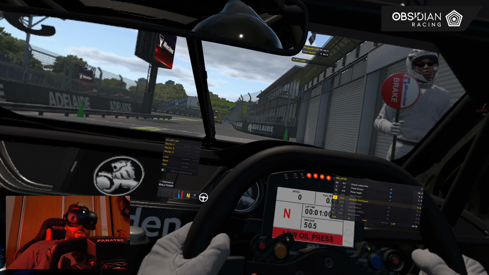
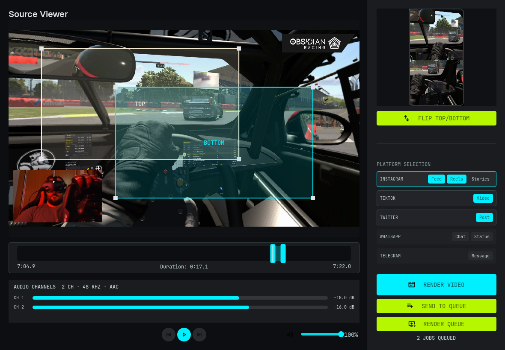
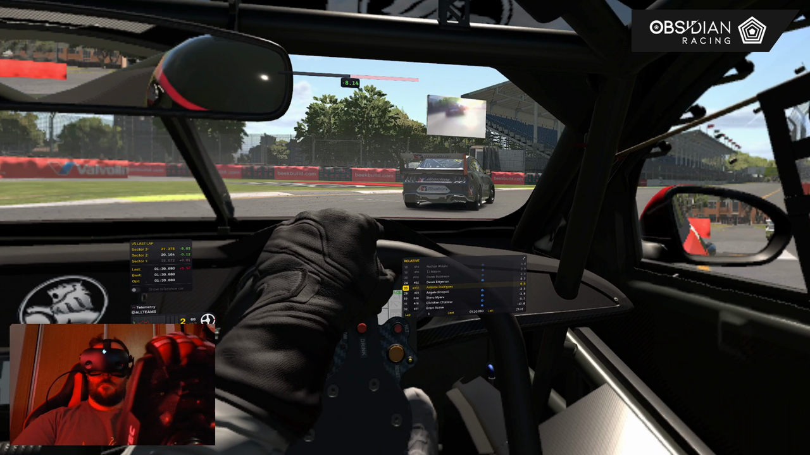
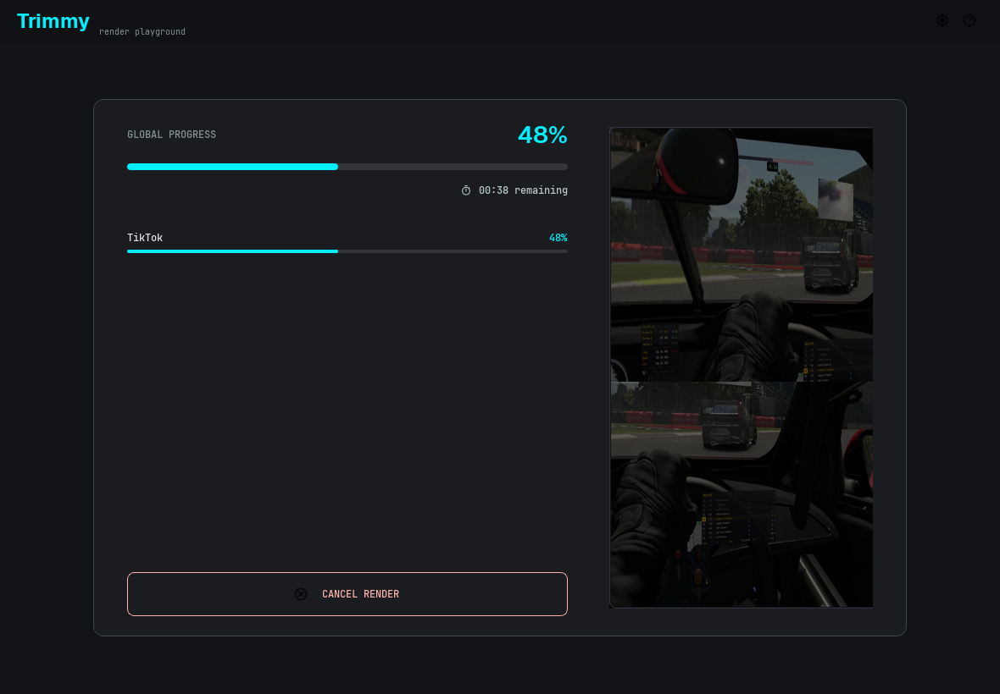
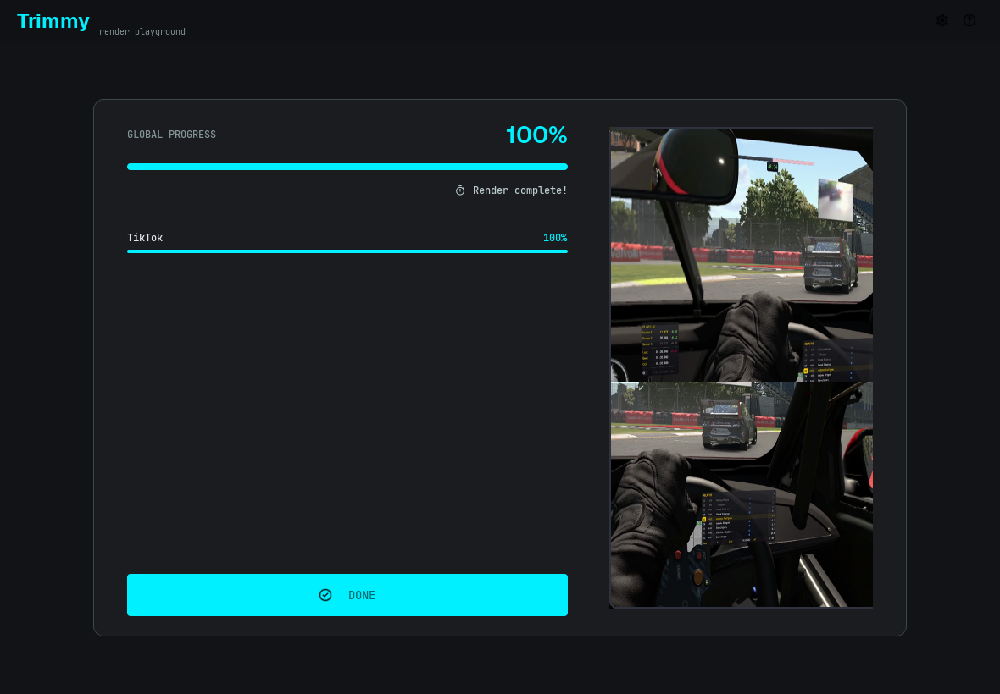
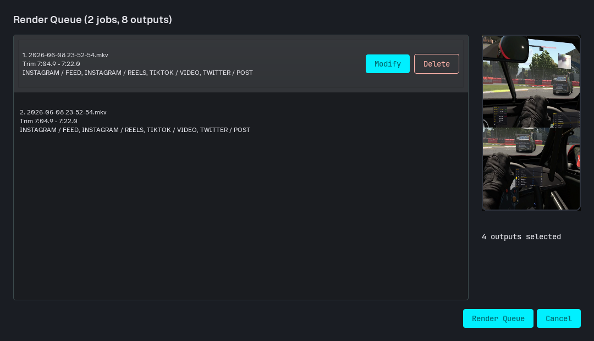
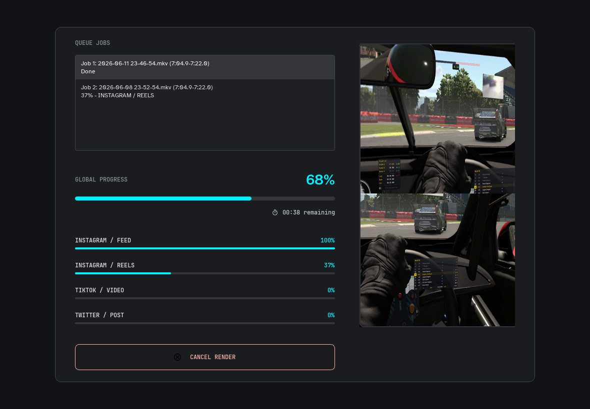

# Tutorial

This tutorial uses the example video:

```text
E:\musan\Videos\2026-06-08 23-52-54.mkv
```

You can use any video file supported by ffmpeg.

## 1. Open the video

Start Trimmy with the file path:

```bash
trimmy "E:\musan\Videos\2026-06-08 23-52-54.mkv"
```

Or open Trimmy first:

```bash
trimmy
```

Then drag the video into the window, or click the open area.

<figure markdown="span">
  { .trimmy-screenshot }
  <figcaption>A frame from the example source video.</figcaption>
</figure>

## 2. Select the two crops

In the source viewer, position the two crop boxes:

* `TOP` becomes the upper half of the vertical output.
* `BOTTOM` becomes the lower half of the vertical output.

The preview on the right shows the final 9:16 composition as you edit.

<figure markdown="span">
  { .trimmy-screenshot }
  <figcaption>The right panel shows the vertical output preview and platform targets.</figcaption>
</figure>

## 3. Trim the timeline

Use the timeline handles to choose the part you want to export.

You can also use keyboard shortcuts:

* `Q`: set trim start to the current playhead.
* `E`: set trim end to the current playhead.
* `K`: play or pause.
* `J` and `L`: seek backward or forward 5 seconds.

For the example video, a good tutorial segment is:

```text
Start: 7:04.9
End:   7:22.0
```

<figure markdown="span">
  { .trimmy-screenshot }
  <figcaption>A frame near the example trim point.</figcaption>
</figure>

## 4. Pick platform targets

Select one or more outputs from the platform panel.

Common choices:

* Instagram `Reels`
* TikTok `Video`
* X `Post`
* WhatsApp `Status`
* Telegram `Message`

Trimmy remembers your selected targets and last output folder.

## 5. Render now

Click `Render Video` to encode the current trim immediately.

<figure markdown="span">
  { .trimmy-screenshot }
  <figcaption>The render screen shows global progress and per-target progress.</figcaption>
</figure>

When the render completes, click `Done` to return to the editor.

<figure markdown="span">
  { .trimmy-screenshot }
  <figcaption>A completed render keeps the preview visible so you can verify the output shape.</figcaption>
</figure>

## 6. Or build a queue

If you want to render several trims, click `Send to Queue`.

Repeat the crop and trim workflow for each segment, then click `Render Queue`.

<figure markdown="span">
  { .trimmy-screenshot }
  <figcaption>The queue review dialog lets you inspect, modify, or delete queued jobs before encoding.</figcaption>
</figure>

During queue rendering, each queued trim and target gets its own progress.

<figure markdown="span">
  { .trimmy-screenshot }
  <figcaption>Queue rendering shows global progress, queued jobs, and selected target details.</figcaption>
</figure>
